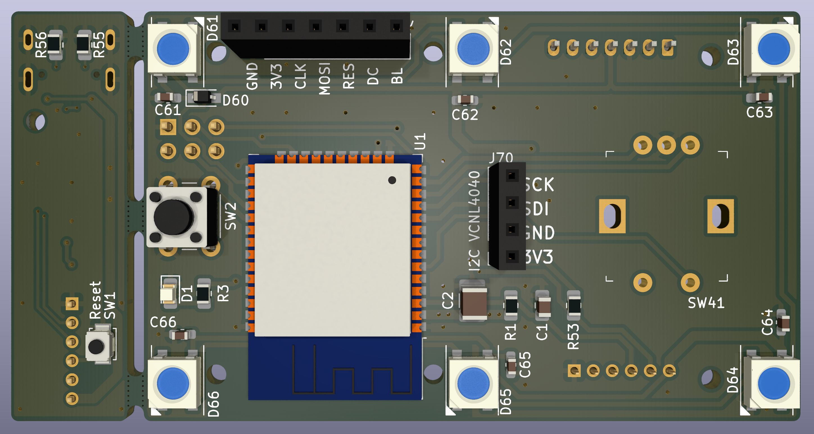
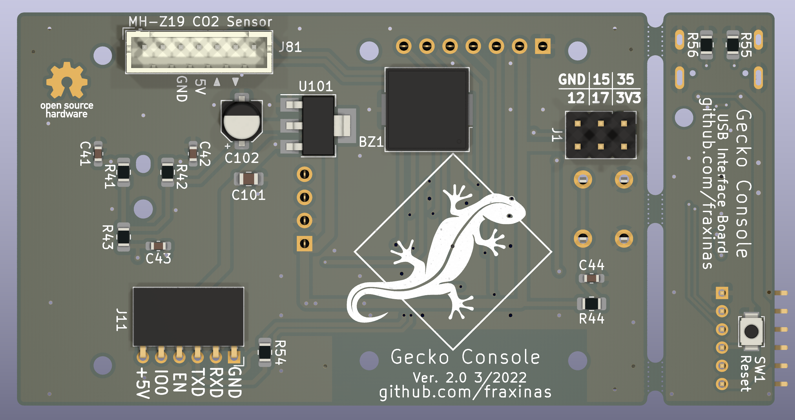

# Geckocontroller

(CC) 2021-2022 by Andreas Frisch <github@fraxinas.dev>

## OwO what's this?
**`geckocontroller` is an ESP32-based all-in-one solution for terrarium automation.**

|  |  |
| :------------------------------------------ | :----------------------------------------- |

## Hardware Features
### Relay Output
* 3 solid state relays with zero-cross switching
* individual load 1A each
* for HeatBed (/Fogger), HeatLamp and Pump

### Dimmer Output
* opto-coupler zero cross detection
* random cross solid state relay
* phase controller modulator

### RGB LED Output
* PWM driver
* for 12V RGB LED stripes

### FAN Output
* for an ATX type PC fan
* PWM and tachometer pins
* power cut-off circuitry for completely stopping all types of fans

### Dallas Thermometer Input
* 2 inputs for DS18B20 bus temperature sensors

### I²C Ports
* BME280 Thermo/Hygro/Baro sensor module (ceiling)
* SHT-3xD Thermo/Hygro sensor (ground)

### Load Cell Input
* HX711-based load cell amplifier/ADC
* for weighing / occupancy detection

### USB-C Port
* USB-to-serial programming port

### WiFi
* ESP32 wifi client

### SPI / Addon Connector
* for future extensions like a display or console

### Documentation
* [Circuit Calculations](hardware/calculations/README.md)

## Software

### Using ESPHome.io
* simple YAML configuration for different sensor / actor modules
* Through Home Assistant web interface:
  * data logging and visualization of all environmental readings
  * manually control all actors, modify set points of controllers

### Weather Simulation
* use Nouvelle-Calédonie (Crested Gecko's natural habitat) real weather records
* use temperature, humidity, rain and sky cover values for creating a realistic varied simulation of the habitants' indigenous environment
* simulated sunrise, sunset, lightening storm

### Documentation
* [How-to Setup & Calibrate](software/README.md)

## Console unit
|     |     |
| :------------------------------------------ | :----------------------------------------- |
* Stand-alone device based on ESP32
* remote controls the main unit through home assistant via WiFi
* 240x240 IPS Display
* Rotary encoder + navigation button
* MH-Z19 CO2 Sensor
* 6x WS2812 addressable RGB LEDs
* Piezo Buzzer for audio alerts
* USB-C powered
* custom esphome components:
  * controls for thermostat, hygrostat, rain, fogger
  * HSV color picker for scenic light

## TODO
### Console unit
- [X] schematic & PCB layout
- [ ] 3d case
- [X] CO2 sensor
- [X] WS2812 RGB LEDs
- [X] buzzer
- [X] software for ST7789 display
- [X] software for rotary encoder
- [ ] VCNL4040 support
- [ ] photos / documentation

### Controller unit
- [x] 3d-printed cases for BME280 sensor and console
- [x] rainfall/humidity automation
- [x] ventilation automation
- [x] moonlight simulation
- [x] thunderstorm simulation
- [ ] photos / documentation

## Project Diary
| Date       | Version | Milestone                                        |
| :--------- | :------ | :----------------------------------------------- |
| 2021-02-21 | v1.0    | Commission of 1st prototype PCB with aisler.net  |
| 2021-03-12 | v1.1    | First time programming of bodged prototype PCB   |
| 2021-04-10 |         | Fixed hardware issues with [LeoDJ](https://github.com/LeoDJ) & [Patagona](https://github.com/patagonaa) |
| 2021-04-15 | v1.2    | Commission of 2nd revision PCB with aisler.net   |
| 2021-05-03 | v1.2    | Completed PCB assembly, all modules working      |
| 2021-05-16 | v1.2    | Assembling of case and first deployment of unit  |
| 2022-01-02 |         | Added fogger to terrarium                        |
| 2022-01-09 |         | Base weather simulation on real historic records |
| 2022-01-28 | v1.0    | Order Console PCB at aisler.net & parts at LCSC  |
| 2022-02-18 |         | Assembled Console PCB                            |
| 2022-03-07 | v2.0    | New Hardware Revision of Console PCB             |
