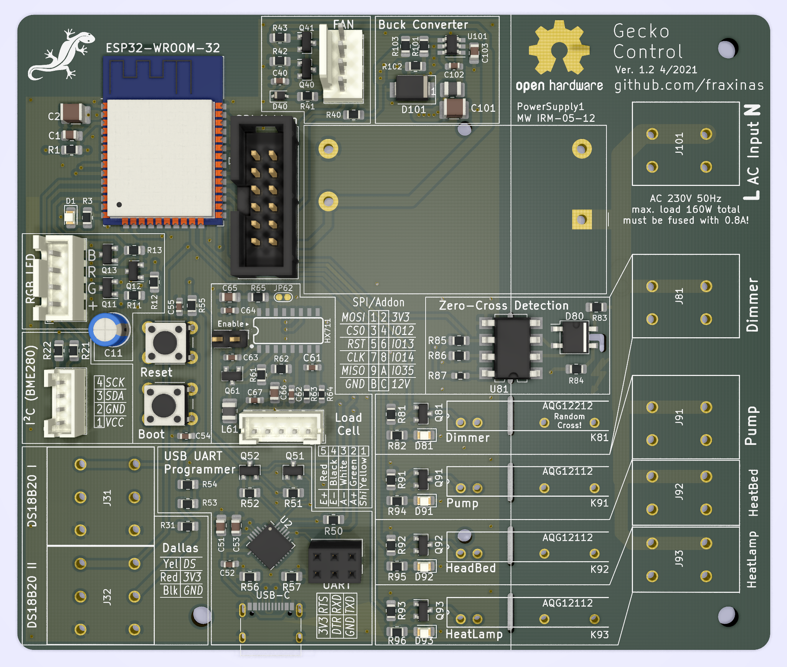

# Geckocontroller

(CC) 2021 by Andreas Frisch <fraxinas@purplegecko.de>

## OwO what's this?
**`geckocontroller` is an ESP32-based all-in-one solution for terrarium automation.**

|  |  |
| :------------------------------------------ | :----------------------------------------- |
|                                         |                                        |

## Hardware Features
### Relay Output
* 3 solid state relays with zero-cross switching
* individual load 1A each
* Labelled HeadBed, HeatLamp and Pump

### Dimmer Output
* opto-coupler zero cross detection
* random cross solid state relay
* phase controller modulator

### RGB LED Output
* PWM driver
* for 12V RGB LED stripes

### FAN Output
* for an ATX type PC fan
* PWM and tachometer pins
* power cut-off circuitry for completely stopping all types of fans

### Dallas Thermometer Input
* 2 inputs for DS18B20 bus temperature sensors

### I²C Port
* for a BME280 Thermo/Hygro/Baro sensor module

### Load Cell Input
* HX711-based load cell ADC
* for weighing / occupancy detection

### USB-C Port
* USB-to-serial programming port

### WiFi
* ESP32 wifi client

### SPI / Addon Connector
* for future extensions like a display or console

## Software
Using ESPHome.io
* simple YAML configuration for different sensor / output modules
* Home Assistant web interface
* picks Nouvelle-Calédonie (Crested Gecko's natural habitat) weather report
* uses actual temperature values for thermostat set points
* simulated sunrise, sunset, lightening storm

## TODO
* case for main unit with power outlets
* rainfall/humidity
* ventilation
* more automation
* console (display / rotary encoder controller unit)
* 3d-printed case for BME280 sensor

## Project Diary
| Date       | Version | Milestone                                       |
| :--------- | :------ | :---------------------------------------------- |
| 2021-02-21 | v1.0    | Commission of 1st prototype PCB with aisler.net |
| 2021-03-12 | v1.1    | First time programming of bodged prototype PCB  |
| 2021-04-10 |         | Fixed hardware issues with [LeoDJ](https://github.com/LeoDJ) & [Patagona](https://github.com/patagonaa) |
| 2021-04-15 | v1.2    | Commission of 2nd revision PCB with aisler.net  |
| 2021-05-03 | v1.2    | Completed PCB assembly, all modules working     |

