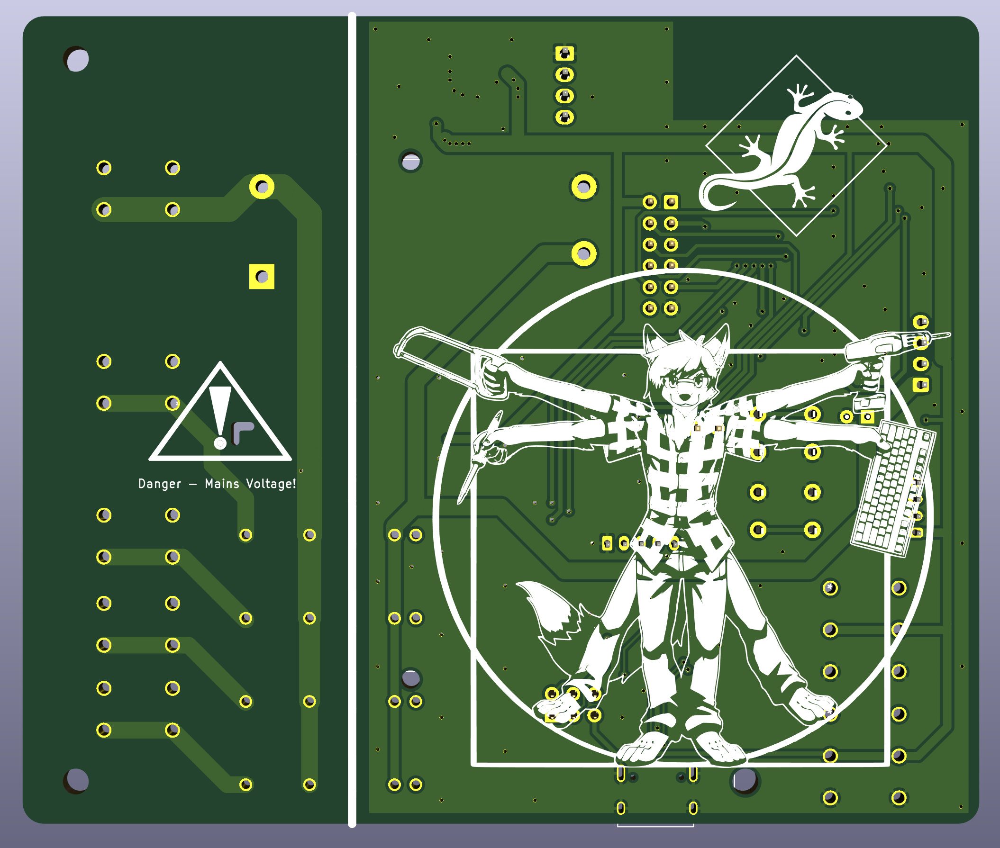

# Geckocontroller

(CC) 2021 by Andreas Frisch <fraxinas@purplegecko.de>

## OwO what's this?
**`geckocontroller` is an ESP32-based all-in-one solution for terrarium automation.**

|  |  |
| :------------------------------------------ | :----------------------------------------- |
|                                         |                                        |

## Hardware Features
### Relay Output
* 3 solid state relays with zero-cross switching
* individual load 1A each
* Labelled HeadBed, HeatLamp and Pump

### Dimmer Output
* opto-coupler zero cross detection
* random cross solid state relay
* phase controller modulator

### RGB LED Output
* PWM driver
* for 12V RGB LED stripes

### FAN Output
* for an ATX type PC fan
* PWM and tachometer pins

### Dallas Thermometer Input
* 2 inputs for DS18B20 bus temperature sensors

### I²C Port
* for a BME280 Thermo/Hygro/Baro sensor module

### Load Cell Input
* HX711-based load cell ADC
* for weighing / occupancy detection

### USB-C Port
* USB-to-serial programming port

### WiFi
* ESP32 wifi client

### SPI / Addon Connector
* for future extensions like a display or console

## Software
TBD. Will be using ESPHome.io
